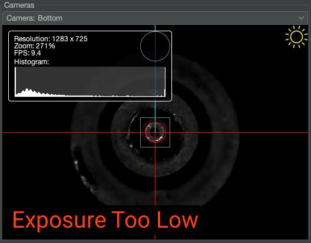
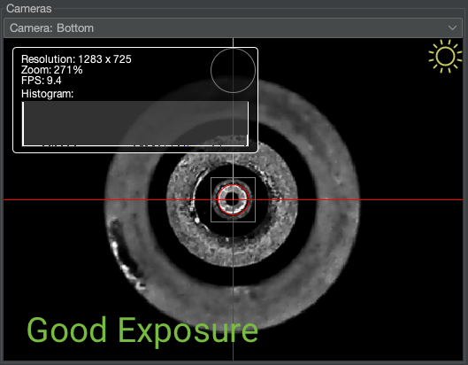
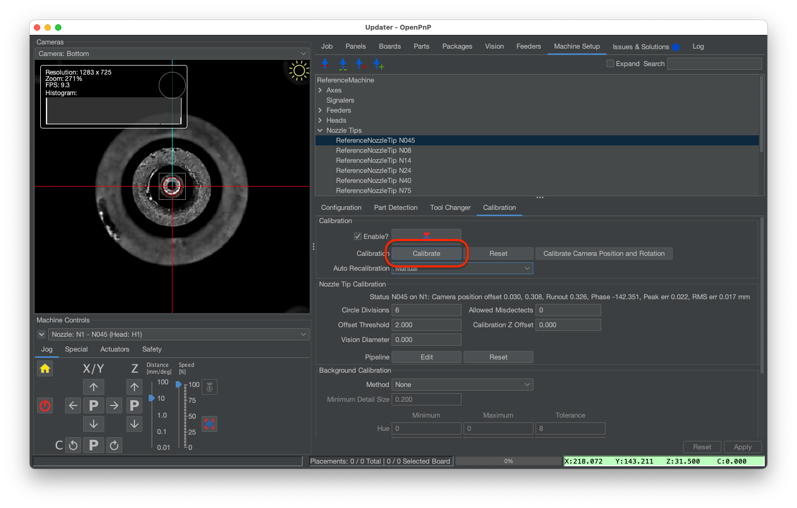
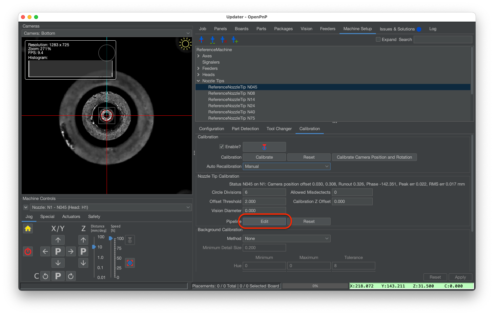
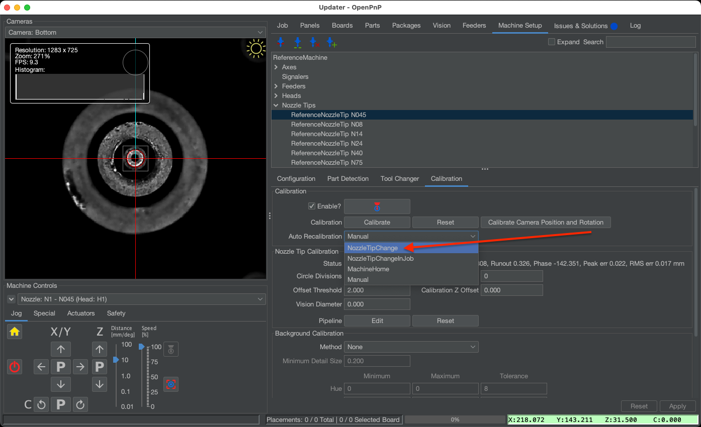

# Nozzle Tip Calibration

Nozzle Tip Calibration lets OpenPnP profile exactly how your nozzles rotate by looking at them with the bottom camera. This calibrates out any runout or misalignment.

See also our [setup video](https://youtube.com/watch?v=CSnczX6VJ7M&si=EnSIkaIECMiOmarE&t=1875).

1. Select `Nozzle: N1` from the dropdown under `Machine Controls`.
   

1. Navigate to `Machine Setup > Cameras > OpenPnPCaptureCamera Bottom`.
  

1. Go to the position tab and click the "Move Nozzle to Position" button.

1. Switch to the `Device Settings` tab. Check, then uncheck the Exposure "Auto" checkbox to set the camera to manual exposure mode.
  

1. Now, we'll set the exposure for the bottom camera, but we'll set it quite a bit less than what we did for the top camera. The bottom camera needs to be able to find the dark hole in the nozzle tip for calibration, but it can't be so bright that we have trouble differentiating between the tip and a part. Use the images below as reference.
  
  
  

    !!! warning "Other Camera Settings"
        There are quite a bit of other settings available to adjust for your camera. In general, we recommend only adjusting the exposure. If you choose to experiment with other sliders, we recommend recording your original values so you can easily get back to a good configuration.

1. Navigate to `Machine Setup > Nozzle Tips > N045 > Calibration`, and click the `Calibrate` button.
  

1. If calibration fails, click the Pipeline `Edit` button to [adjust the nozzle tip vision pipeline](../../vision-pipeline-adjustment/4-nozzle-calibration-pipeline.md), then retest.

1. Once you've calibrated successfully, set `Auto Recalibration` from `Manual` to `NozzleTipChange`. This will cause OpenPnP to calibrate any loaded N045 nozzle tips after homing, or after swapping tips. Hit `Apply` to save your changes.

1. Repeat this section but instead using N2 and the N24 nozzle tip. If you need to change the exposure during this, be sure to test the N045 calibration again to make sure it works with the new exposure setting.

1. As a final check, home your LumenPnP again to ensure that homing fiducial detection and nozzle tip calibration finish successfully without errors.

1. After you've settled on an exposure setting, record the final exposure value for inputting when restarting OpenPnP as you did for the top camera.

Next is configuring the [vacuum sensor](../10-vacuum-sensor/index.md).
